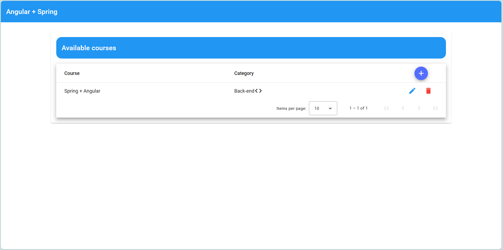
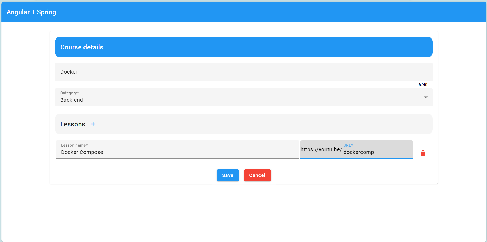
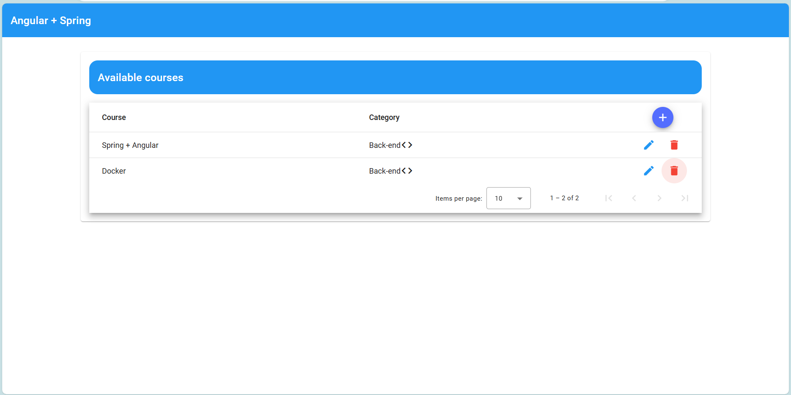
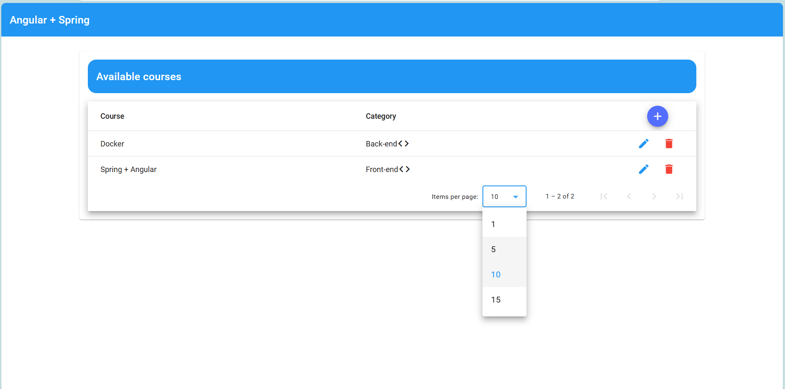

<h1 align="center"> Courses </h1>

  <a href="#-tecnologies">Technologies</a>&nbsp;&nbsp;&nbsp;|&nbsp;&nbsp;&nbsp;
  <a href="#-project">Project</a>&nbsp;&nbsp;&nbsp;|&nbsp;&nbsp;&nbsp;
  <a href="#memo-license">License</a>
  

  

 

## 🚀 Tecnologies

This application lists courses using basic CRUD operations with back-end code.

- Angular
- SCSS
- CORS
- Git & Github 

  

## 💻 Project

This project offers a straightforward API for managing courses and lessons, featuring robust validations and adhering to SOLID principles in its design.

 

## :memo: License

This project is under license from MIT

 

## Images 

 

### Home page
 - 
 This page contains all registered courses : 

 
 

  

 

 

### Register a course
 - 
 This page contains a basic form with validations to register a course: 

 

  

 

 

 - 
 After creating a course, the list is updated: 

 

  

 

 

### Other features
 - 
 To update a course, delete and list limited courses on a page you, can use the icons: 

 

  

 

 

Thanks for your attention, see you next time 💜

